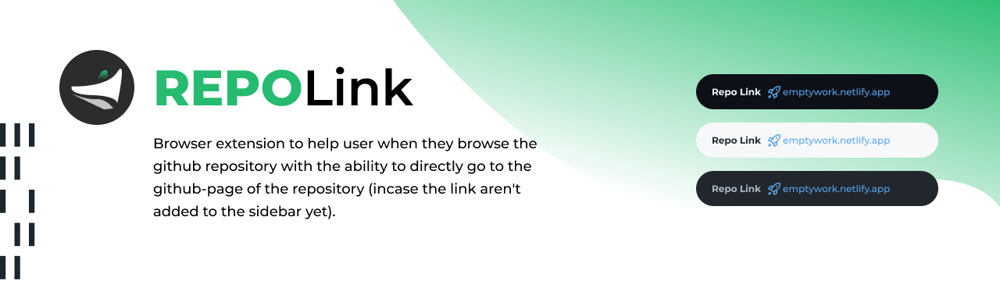

# Repo Link Extension

`An extension` that add a new section on top of repository's title, it contains `the link for the repo` — only if the repository has an active external link on it's description area, or the github-pages environment is activated.

## Links

